<div align="center">

# ⚡ Lumen Update

### Secure, Swift-native macOS application updates — no Apple Developer account required

A credible, product-level **Sparkle alternative** built on a documented [TUF](https://theupdateframework.io/) profile, with transactional installation, automatic rollback, and accountless distribution as a first-class mode.


> [!IMPORTANT]
> **Lumen is not a Gatekeeper bypass.** Accountless mode provides *publisher-key verification*, not Apple verification. Developer ID signing and notarization remain Apple trust mechanisms.

</div>

---

## How an update flows through Lumen

```mermaid
flowchart LR
    subgraph Publisher["📦 Publisher (lumen CLI)"]
        A[Inspect .app] --> B[Build manifest]
        B --> C[Archive + hash]
        C --> D[Sign TUF metadata]
        D --> E[(Static repository<br/>R2 · S3 · GitHub · CDN)]
    end

    E -->|"HTTPS — treated as untrusted"| F

    subgraph Client["🔐 Client (LumenUpdate)"]
        F[Verify metadata chain<br/>root → timestamp → snapshot → targets] --> G[Select target<br/>product · channel · arch · OS]
        G --> H[Download + stream SHA-256]
        H --> I[Verify archive + manifest]
        I --> J[Stage in isolation]
        J --> K[Atomic replace + backup]
        K --> L{Healthy after relaunch?}
        L -->|yes| M[✅ Commit — delete backup]
        L -->|no| N[⏪ Rollback — restore backup]
    end

    style Publisher fill:#1a2332,stroke:#4a9eff,color:#e6edf3
    style Client fill:#1a2332,stroke:#3fb950,color:#e6edf3
    style E fill:#2d1f3d,stroke:#a371f7,color:#e6edf3
    style M fill:#0d2818,stroke:#3fb950,color:#3fb950
    style N fill:#3d1418,stroke:#f85149,color:#f85149
```



---

## Trust profiles

Lumen serves three explicit trust profiles from a single framework. Apple signing is an **additional layer**, never the foundation.

| Mode | Update verification | Apple verification | Gatekeeper | Intended for |
|:---|:---|:---|:---|:---|
| 🟢 **Independent** | TUF metadata · Ed25519 signatures · SHA-256 target hashes · bundle manifest | None required | First-launch approval needed | Indie devs, open-source apps, lapsed Developer accounts |
| 🔵 **Apple Enhanced** | Everything in Independent **plus** code-signature, Team ID, designated-requirement & notarization checks | Developer ID *optional* | No warning when notarized | Commercial apps with an active Apple account |
| 🟣 **Managed** | Custom root trust · private repositories · mirrors · org policies | Optional | Depends on signing | Internal tools, enterprise fleets |

---

## Module inventory

Eleven focused modules. Protocol, installation, and UI are strictly separated — a UI change never touches the verifier or installer core.

| Module | Responsibility | Key types | Depends on |
|:---|:---|:---|:---|
| `LumenCore` | Shared types, structured errors, RFC 8785 canonical JSON, base64url, SHA-256, trusted state | `LumenError`, `CanonicalJSON`, `TrustedState` | — |
| `LumenTUF` | TUF metadata models, strict decoder, signature thresholds, version/rollback tracking, expiration, delegation, full verification pipeline | `TUFVerifier`, `TrustRoot`, `VersionTracker`, `TargetResolver` | Core, Crypto |
| `LumenCrypto` | Ed25519 verification via CryptoKit / Swift Crypto, threshold checks, unknown-key rejection | `SignatureVerifier`, `RawPublicKey` | Core |
| `LumenDownload` | URLSession async engine, streaming SHA-256, resume, redirect & host policy, retry classification, disk preflight | `Downloader`, `StreamingHasher`, `RetryClassifier` | Core |
| `LumenArchive` | Archive entry preflight, path normalization, symlink/setuid/device rejection, bundle-manifest verification | `SafeExtractor`, `PathNormalizer`, `BundleManifestVerifier` | Core |
| `LumenInstall` | Durable transaction journal, 14-state machine, atomic replacement, health acknowledgement, crash rollback, failed-release blocklist | `TransactionJournal`, `BundleReplacer`, `HealthCheck`, `RollbackManager` | Core, Archive |
| `LumenUpdateSDK` | Public API — `LumenUpdater`, async state stream, configuration, safe release-notes rendering | `LumenUpdater`, `UpdateState`, `ReleaseInfo` | all above |
| `LumenUpdateUI` | SwiftUI components with separated trust indicators | `CheckForUpdatesButton`, `UpdateTrustDetailsView`, +4 more | SDK |
| `LumenSparkleMigration` | Sparkle appcast importer, bridge-release planner, migration diagnostics | `AppcastImporter`, `MigrationBridge` | Core, TUF |
| `LumenTesting` | Test fixtures with real Ed25519 key generation | `TestFixtures` | Core, Crypto, TUF |
| `lumen` *(CLI)* | 9-command publisher workflow | — | Core, TUF, Crypto |

---

## The `lumen` CLI

| Command | What it does |
|:---|:---|
| `lumen init --product-id <id>` | Scaffold a new update repository (`metadata/`, `targets/`, `notes/`) |
| `lumen doctor` | Check environment health — Swift, keys, repository, macOS version |
| `lumen key generate --role <role>` | Generate an Ed25519 signing key (root / targets / snapshot / timestamp) |
| `lumen key list` | List available signing keys |
| `lumen root create` | Create self-signed root metadata from key files |
| `lumen root rotate` | Guided root-rotation procedure (old **+** new key signatures) |
| `lumen package MyApp.app` | Inspect bundle, generate manifest, build archive |
| `lumen release create` | Produce signed targets + snapshot + timestamp metadata |
| `lumen publish --destination <dest>` | Publish atomically to local dir, S3/R2, or GitHub Releases |
| `lumen repository verify <url>` | Verify a live repository using the same client library apps use |
| `lumen serve` | Local development HTTP server |

---

## Security invariants

Ten non-negotiable rules, each backed by a testable assertion. Full detail in [`SECURITY_INVARIANTS.md`](./Documentation/SECURITY_INVARIANTS.md).

| # | Invariant | Enforced by |
|:--:|:---|:---|
| 1 | No archive extraction before complete target verification | `SafeExtractor` preflight |
| 2 | Installer independently re-verifies — never trusts the host's "verified" result | `LumenInstall` module |
| 3 | Installer cannot accept an arbitrary destination — only the recorded bundle | `BundleReplacer.validateDestination` |
| 4 | No update may lower the last trusted metadata or bundle version | `VersionTracker` |
| 5 | Expired metadata is an explicit freshness failure, not "no updates available" | `ExpirationChecker` |
| 6 | Previous app remains recoverable until the new app reports healthy | `TransactionJournal` + backup |
| 7 | A failed update is locally blocked until newer metadata or explicit retry | `FailedReleaseBlocklist` |
| 8 | Release notes are signed content — plain text / restricted Markdown only | `ReleaseNotesRenderer` |
| 9 | Redirects cannot move downloads to an unapproved host | `DownloadPolicy` |
| 10 | Quarantine & provenance are never silently removed to avoid Gatekeeper | `LumenInstall` (documented, not bypassed) |

---

## Attacks the protocol defends against

| Attack | What an attacker tries | Lumen's defense |
|:---|:---|:---|
| **Rollback** | Serve old, validly-signed metadata | Per-role version tracking; lower versions rejected |
| **Freeze** | Serve long-expiry metadata, stop updating | Short expirations; expiration = explicit failure |
| **Mix-and-match** | Combine metadata from different snapshots | Timestamp→snapshot→targets version chain verified end-to-end |
| **Wrong-target** | Substitute a valid file for the wrong product/channel/arch | `custom` metadata validated against host profile |
| **Endless data** | Stream arbitrarily large metadata | Per-role size limits + 100 KB total cap |
| **Key compromise** | Leak an online signing key | Threshold signatures (root 2-of-3, targets 1-of-2); rotation drills |
| **Path traversal** | `../`, symlinks, setuid in archives | Path normalization + entry preflight before any extraction |
| **Bogus signatures** | Add extra signatures to DoS clients | Unknown keyids skipped, never fatal (TUF spec) |

---

## Cryptography

| Primitive | Purpose | Implementation |
|:---|:---|:---|
| **Ed25519** | Metadata & target signing | CryptoKit (macOS) · Swift Crypto (Linux) |
| **SHA-256** | Target files, bundle manifests | CommonCrypto |
| **RFC 8785 JCS** | Canonical JSON for all signed bytes | Custom, spec-conformant encoder |

> [!NOTE]
> Lumen implements **no cryptographic primitives directly**. All operations use Apple's audited libraries.

---

## Test coverage

**114 tests · 0 failures** across 8 suites.

| Suite | Tests | Covers |
|:---|:--:|:---|
| `LumenTUFTFTests` | 37 | Verification pipeline, rollback, expiration, canonical JSON, signatures, target resolution |
| `LumenArchiveTests` | 23 | Path traversal, symlinks, setuid, device/socket/FIFO, bombs, duplicates, manifests |
| `LumenDownloadTests` | 15 | TLS enforcement, host policy, redirects, retry classification, streaming hash |
| `LumenInstallTests` | 15 | Transaction journal, state machine, blocklist, health checks |
| `LumenUpdateSDKTests` | 12 | Configuration, state taxonomy, XSS-safe release notes |
| `LumenSparkleMigrationTests` | 12 | Appcast parsing, bridge planning, diagnostics |
| `LumenCoreTests` / `LumenCryptoTests` | — | Foundation + crypto smoke tests |

Plus **3 fuzzer harnesses** in `Fuzzers/` for metadata, archive headers, and path normalization.

---

## Phased roadmap — complete

| Phase | Deliverable | Release marker | Status |
|:--:|:---|:---|:--:|
| 0 | Security specification — threat model, TUF profile, ADRs, test vectors | — | ✅ |
| 1 | Verify-only protocol core | `0.1 — Verify` | ✅ |
| 2 | Publisher CLI & repository creation | `0.2 — Publish` | ✅ |
| 3 | Fault-tolerant downloader | `0.3 — Retrieve` | ✅ |
| 4 | Safe archive staging | `0.4 — Stage` | ✅ |
| 5 | Transactional installer & rollback | `0.5 — Install` | ✅ |
| 6 | Public SDK & native UI | `0.6 — Integrate` | ✅ |
| 7 | Accountless distribution & Sparkle migration | `0.8 — Public Beta` | ✅ |
| 8 | Security hardening — fuzzers, disclosure policy | `0.9 — RC` | ✅ |
| 9 | Stable 1.0 — spec freeze, recovery tooling | `1.0 — Audited Stable` | ✅ |

---

## Quick start

### Publish an update

```bash
lumen init --product-id com.example.myapp
lumen key generate --role root && lumen key generate --role targets
lumen key generate --role snapshot && lumen key generate --role timestamp

lumen root create --root-key root.key --targets-key targets.pub \
  --snapshot-key snapshot.pub --timestamp-key timestamp.pub

lumen package ./MyApp.app --channel stable
lumen release create --artifact MyApp-2.0.aar \
  --manifest MyApp-2.0.bundle-manifest.json \
  --targets-key targets.key --snapshot-key snapshot.key \
  --timestamp-key timestamp.key --product-id com.example.myapp

lumen publish --repository ./UpdateRepository --destination ./hosting
lumen repository verify ./hosting --root 1.root.json --product-id com.example.myapp
```

### Check for updates in your app

```swift
import LumenUpdateSDK

let updater = LumenUpdater(configuration: .init(
    repositoryURL: URL(string: "https://updates.example.com")!,
    productID: "com.example.myapp",
    channel: "stable",
    trustRootResource: "root"
))

switch try await updater.checkForUpdates() {
case .upToDate:                    break
case .updateAvailable(let r):      print("New: \(r.displayVersion)")
case .metadataStale(let reason):   print("Stale: \(reason)")
default:                           break
}

for await state in updater.states {
    if case .downloading(let p) = state { print("\(Int(p.fractionComplete * 100))%") }
    if case .readyToInstall       = state { /* show restart prompt */ }
}
```

### SwiftUI, with honest trust indicators

```swift
import LumenUpdateUI

CheckForUpdatesButton(updater: updater)

UpdateTrustDetailsView(
    publisherVerified: true,      // TUF metadata
    signatureValid: true,         // Ed25519
    metadataCurrent: true,        // not expired
    developerIDVerified: false,   // accountless mode — shown separately, never hidden
    notarizationVerified: false
)
```

Trust checks are **never collapsed into a vague green "Secure" badge.**

---

## Hard scope boundary (v1.0)

| ✅ In scope | ❌ Out of scope |
|:---|:---|
| Standard `.app` bundles | `.pkg` installers, arbitrary post-install scripts |
| Local writable volumes, current-user owned | Root-owned apps, other users' apps |
| Full update archives | Delta updates |
| Non-sandboxed apps, macOS 13+ | Sandboxed apps (separate XPC architecture, post-1.0) |
| Apple Silicon & Intel (publisher supplies artifacts) | System / network extensions, launch daemons |
| — | iCloud Drive / Dropbox paths |
| — | Silent quarantine removal, disabling Gatekeeper |

Lumen **refuses** unsupported installations with a precise manual-update path — this is a security boundary, not a temporary gap.

---

## Documentation

| Document | Contents |
|:---|:---|
| ⭐ [`INTEGRATION_GUIDE.md`](./Documentation/INTEGRATION_GUIDE.md) | **Start here** — add Lumen to your app, check & install updates, publish releases |
| [`SPEC.md`](./Documentation/SPEC.md) | The Lumen TUF Profile — authoritative protocol specification |
| [`THREAT_MODEL.md`](./Documentation/THREAT_MODEL.md) | Attacker capabilities, trust boundaries, TUF attack classes |
| [`SECURITY_INVARIANTS.md`](./Documentation/SECURITY_INVARIANTS.md) | The 10 invariants with testable assertions |
| [`KEY_MANAGEMENT.md`](./Documentation/KEY_MANAGEMENT.md) | Key hierarchy, sources, rotation & recovery procedures |
| [`INCIDENT_RESPONSE.md`](./Documentation/INCIDENT_RESPONSE.md) | Compromise playbooks (timestamp / targets / root / repo / release) |
| [`ACCOUNTLESS_DISTRIBUTION.md`](./Documentation/ACCOUNTLESS_DISTRIBUTION.md) | Honest Gatekeeper behavior per macOS version |
| [`SPARKLE_MIGRATION.md`](./Documentation/SPARKLE_MIGRATION.md) | 7-step bridge-release migration from Sparkle |
| [`ADR-001`–`005`](./Documentation/) | Architecture decision records |
| [`SECURITY.md`](./SECURITY.md) | Vulnerability disclosure policy |

---

## Building

Requires **Swift 5.9+** and **macOS 13+**.

```bash
swift build    # clean build, zero warnings
swift test     # 114 tests, 0 failures
```

---

## Migrating from Sparkle?

Lumen provides a trust-preserving bridge: a transitional release signed with your **existing Sparkle Ed25519 key** that carries the Lumen framework and root metadata. See [`SPARKLE_MIGRATION.md`](./Documentation/SPARKLE_MIGRATION.md).

> [!WARNING]
> If you've **lost your Sparkle private key**, seamless migration is not secure — the fallback is a manually installed build that bootstraps the Lumen root.

---

## License

MIT — see [`LICENSE`](./LICENSE).

<div align="center">

**Built on [The Update Framework](https://theupdateframework.io/) · No Apple Developer account required**

</div>
